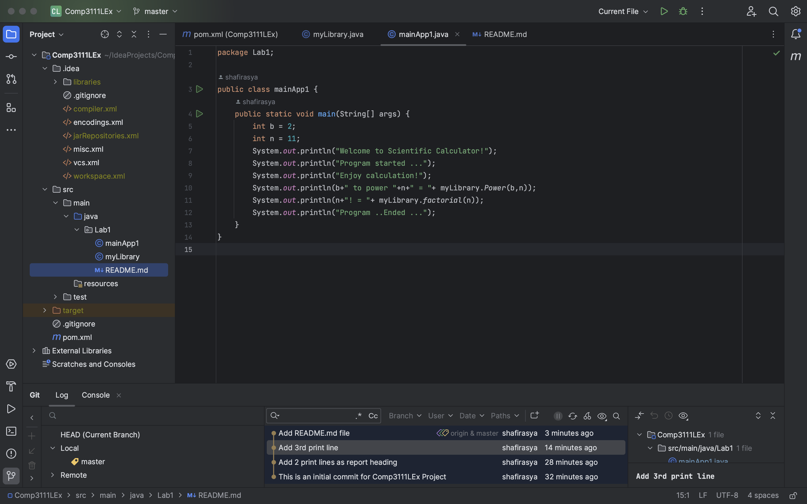

# COMP3111 Software Engineering - Lab 1

Welcome! This is the first lab of COMP3111 course at HKUST developed by Monica (20817930).

## Project Description

In this lab, we installed IntelliJ and Java SDK alongside a dependency, then we write some basic codes in our Java files.

This is how the project looks:
